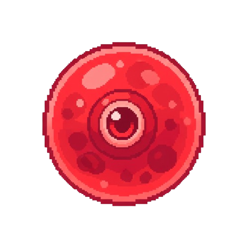

# CELL-VENGEANCE



CELL-VENGEANCE, Phaser 3 + Next.js ile geliştirilen 2D aksiyon platform oyunudur. Oyuncu düşmanlardan düşen hücreleri emerek bölüm içinde görsel olarak büyür; bölüm sonundaki markette ise artan hücrelerle kalıcı güçlendirmeler satın alır.

## Oynanış Özeti
- Düşmanları `J` saldırısı veya üstten stomp ile etkisiz hale getir.
- Düşen hücre pickup'ları oyuncuya animasyonla çekilir ve puan işlenir.
- Büyüme eşiklerinde (12 / 28 / 52) oyuncu görsel olarak büyür.
- Bölüm sonunda kapı temasında `Enter` ile geçiş yapılır.
- Bölüm sonu ekranında yalnızca artan hücreler cüzdana aktarılır ve markette harcanır.

## Büyüme Sistemi (Evrim Yerine)
Büyüme artık marketten satın alınmaz; bölüm içinde toplanan hücreye bağlıdır.

- `collectedCells`: Toplanan toplam hücre
- `spentForGrowth`: Büyüme eşiklerinde harcanan hücre
- `residualCells`: Cüzdana taşınan artan hücre

Formül:
- `residualCells = collectedCells - spentForGrowth`

Büyüme aşamaları (yalnızca görsel):
- Aşama 0 -> `0.48`
- Aşama 1 -> `0.54`
- Aşama 2 -> `0.60`
- Aşama 3 -> `0.66`

## Market Ürünleri
- `maxHp`: Maksimum can
- `attack`: Saldırı gücü
- `moveSpeed`: Yürüme/koşu hızı
- `jumpPower`: Zıplama kuvveti
- `dashBoost`: Dash bonusu

Not: Dash artık evrime değil, `dashBoost >= 1` koşuluna bağlıdır.

## Bölüm Akışı
- Toplam 3 bölüm vardır.
- Başlangıçta yalnızca Bölüm 1 açıktır, bitirdikçe yeni bölüm açılır.
- 3. bölüm sonrası “Oyunun devamı gelecek” ekranı gösterilir ve serbest bölüm seçimi açılır.

## Kontroller
- Hareket: `A / D` veya `Sol / Sağ`
- Zıplama: `Space` veya `W`
- Saldırı: `J`
- Dash: `Shift` (dashBoost açıldıysa)
- Kapı Geçişi: `Enter`

## Kurulum ve Çalıştırma
1. Bağımlılıkları kur:
   - `pnpm install`
2. Geliştirme sunucusunu başlat:
   - `pnpm dev`
3. Tür kontrolü:
   - `npx tsc --noEmit`
4. Production build:
   - `pnpm build`

## Temel Dizin Yapısı

```text
src/
  game/
    animations/
    config/
    constants/
    data/
      enemyConfigs.ts
      growthConfig.ts
      levels.ts
      shopCatalog.ts
    entities/
      enemies/
      level/
      player/
      projectiles/
    scenes/
      BootScene.ts
      PreloadScene.ts
      IntroScene.ts
      MainMenuScene.ts
      LevelSelectScene.ts
      SettingsScene.ts
      GameScene.ts
      HudScene.ts
      LevelCompleteScene.ts
    services/
    state/
      GameState.ts
    systems/
      EnemyManager.ts
    types/

public/
  assets/
    characters/
      1.png
    enemy/
    maps/
  maps/
    map1.json
    map2.json
    map3.json
```

## Teknik Notlar
- Eski `evolution` upgrade'i kaldırılmıştır.
- Eski kayıtta bulunan `evolution` alanı sessizce yok sayılır.
- Karakter için tek spritesheet kullanılır: `public/assets/characters/1.png`.
